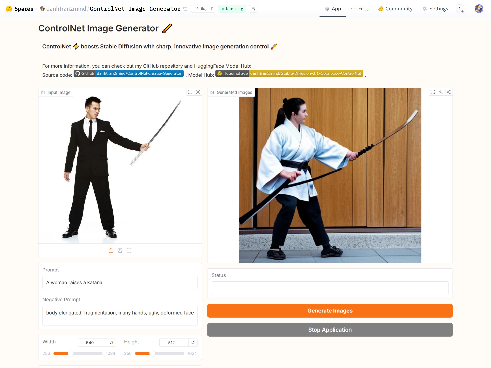
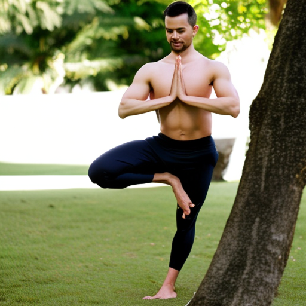
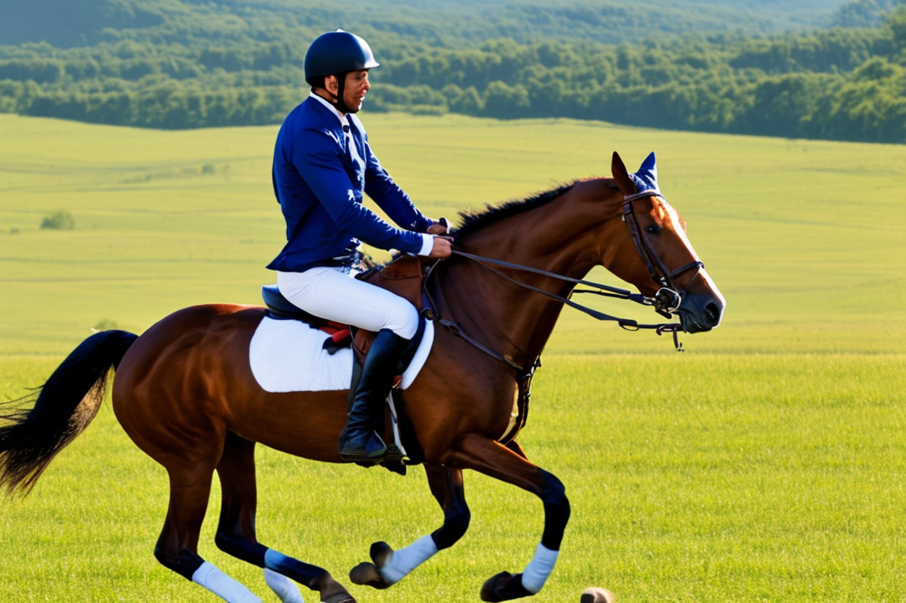
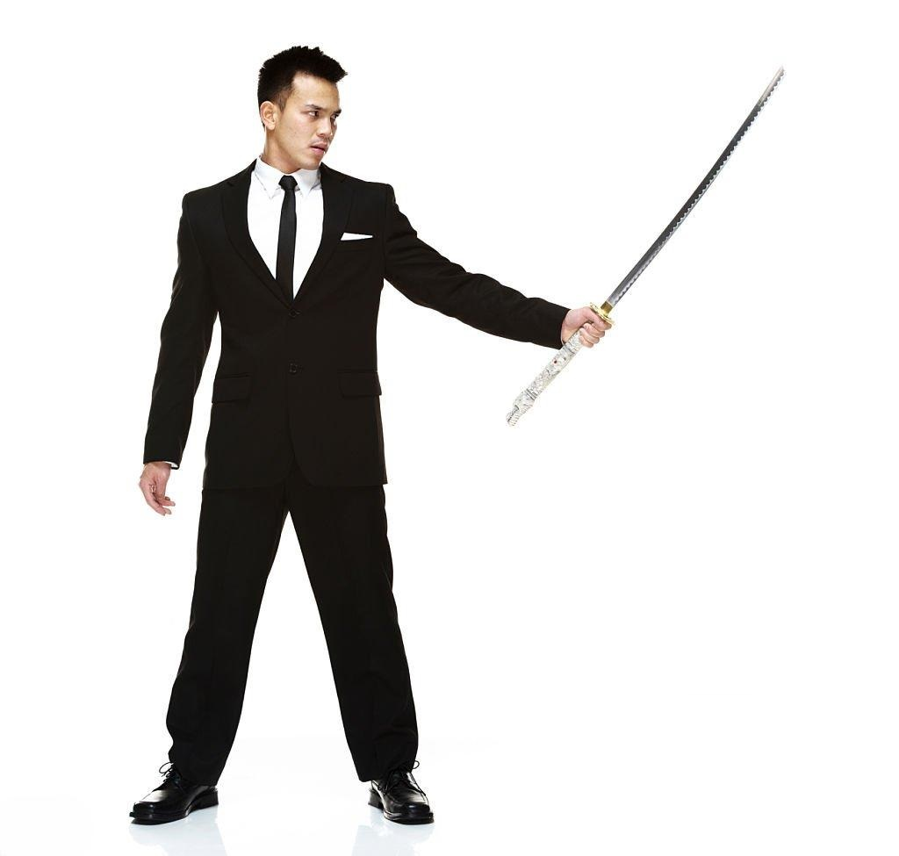
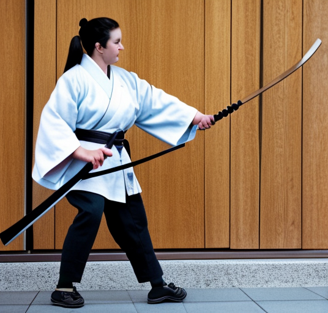

# ControlNet Image Generator 🖌️

[](https://github.com/danhtran2mind/ControlNet-Image-Generator/stargazers)


[](https://huggingface.co/docs/hub)
[](https://huggingface.co/docs/accelerate)
[](https://github.com/TimDettmers/bitsandbytes)
[](https://pytorch.org/)
[](https://pypi.org/project/pillow/)
[](https://numpy.org/)
[](https://huggingface.co/docs/transformers)
[](https://pytorch.org/vision/stable/index.html)
[](https://huggingface.co/docs/diffusers)
[](https://huggingface.co/docs/peft)
[](https://github.com/patrickvonplaten/controlnet_aux)
[](https://gradio.app/)
[](https://opensource.org/licenses/MIT)

## Introduction 🌟

The **ControlNet Image Generator** is an open-source tool 🛠️ leveraging Stable Diffusion 2.1 and ControlNet with OpenPose to create high-quality, pose-guided images 📸. Perfect for researchers and developers 👩‍💻, it offers precise human pose conditioning, interactive demos, and flexible training/inference scripts under the MIT license 📜.

## Key Features 🚀

- **Pose-Guided Generation** 🕺: Uses OpenPose and ControlNet for accurate pose-conditioned images.
- **Stable Diffusion 2.1 Base** 🖼️: Built on Stability AI’s robust model for top-notch results.
- **Interactive Gradio Demo** 🎮: User-friendly interface hosted on Hugging Face Spaces.
- **Customizable Scripts** ⚙️: Supports training and inference with detailed options.
- **Notebook Compatibility** 📒: Works with Colab, SageMaker, Deepnote, JupyterLab, Gradient, Binder, and Kaggle.
- **Optimized Dependencies** 💻: Uses `diffusers`, `transformers`, `torch`, `gradio`, and more for efficiency.
- **Specialized Dataset** 📊: Trained on HighCWu/open_pose_controlnet_subset for pose accuracy.
- **Local & Cloud Support** ☁️: Run locally or explore on cloud platforms.
- **Comprehensive Docs** 📚: Guides for installation, training, and inference.
- **Open-Source** 🌍: MIT-licensed, community-driven via GitHub.

## Notebook

Explore the Openpose-guided ControlNet implementation in the following notebook:

[](https://colab.research.google.com/github/danhtran2mind/ControlNet-Image-Generator/blob/main/notebooks/SD-2.1-Openpose-ControlNet.ipynb)
[](https://studiolab.sagemaker.aws/import/github/danhtran2mind/ControlNet-Image-Generator/blob/main/notebooks/SD-2.1-Openpose-ControlNet.ipynb)
[](https://deepnote.com/launch?url=https://github.com/danhtran2mind/ControlNet-Image-Generator/blob/main/notebooks/SD-2.1-Openpose-ControlNet.ipynb)
[](https://mybinder.org/v2/gh/danhtran2mind/ControlNet-Image-Generator/main?filepath=notebooks/SD-2.1-Openpose-ControlNet.ipynb)
[](https://console.paperspace.com/github/danhtran2mind/ControlNet-Image-Generator/blob/main/notebooks/SD-2.1-Openpose-ControlNet.ipynb)
[](https://mybinder.org/v2/gh/danhtran2mind/ControlNet-Image-Generator/main)
[](https://www.kaggle.com/notebooks/welcome?src=https%3A%2F%2Fgithub.com%2Fdanhtran2mind%2FControlNet-Image-Generator/blob/main/notebooks/SD-2.1-Openpose-ControlNet.ipynb)
[](https://github.com/danhtran2mind/ControlNet-Image-Generator/blob/main/notebooks/SD-2.1-Openpose-ControlNet.ipynb)


## Dataset
The Stable-Diffusion-2.1-Openpose-ControlNet model was trained on the [](https://huggingface.co/datasets/HighCWu/open_pose_controlnet_subset) dataset, available at Hugging Face. This dataset provides specialized data for fine-tuning, enabling precise human pose conditioning using OpenPose for enhanced image generation.

## Base Model
The Stable-Diffusion-2.1-Openpose-ControlNet is built upon the [](https://huggingface.co/stabilityai/stable-diffusion-2-1) base model. This foundation model, developed by Stability AI, serves as the core architecture, which is further refined with ControlNet to improve control and accuracy in generating pose-conditioned images.


## Installation
### Clone GitHub Repository
```bash
git clone https://github.com/danhtran2mind/ControlNet-Image-Generator.git
cd ControlNet-Image-Generator
```
### Install Dependencies
```bash
pip install -r requirements/requirements.txt
```
### Script-Driven Setup

#### Download Model Checkpoints
```bash
python scripts/download_ckpts.py
```
#### Download Datasets

```bash
python scripts/download_datasets.py
```

#### Setup Third Party (Diffusers for ControlNet Training)
```bash
python scripts/setup_third_party.py
```

For more information about Scripts, you can see [Download Model Checkpoint Document](docs/scripts/download_ckpts_doc.md) and [Download Dataset Document](docs/scripts/download_datasets_doc.md). ⚙️

## Demonstration

### Interactive Demo

Explore the interactive demo hosted on HuggingFace:
[](https://huggingface.co/spaces/danhtran2mind/Anime-Super-Resolution).

Below is a screenshot of the SlimFace Demo GUI:



### Run Locally

To run the Gradio application locally at the default address `localhost:7860`, execute:

```bash
python apps/gradio_app.py
```

## Usage
### Training
#### Training Script
```bash
accelerate launch src/controlnet_image_generator/train.py \
    --pretrained_model_name_or_path="<model_name_or_path>" \
    --output_dir="<output_path>" \
    --dataset_name="<dataset_name>" \
    --resolution=<image_resolution> \
    --learning_rate=<lr_value> \
    --train_batch_size=<batch_size> \
    --gradient_accumulation_steps=<grad_steps> \
    --gradient_checkpointing \
    --use_8bit_adam \
    --num_train_epochs=<num_epochs> \
    --mixed_precision "<precision_type>" \
    --checkpoints_total_limit=<num_limit_ckpts> \
    --checkpointing_steps=<num_checkpoint_step> \
    --validation_steps=<num_step>
```
#### Training Document
For more information about Training, you can see [Training Document](docs/training/training_doc.md). ⚙️

### Inference
#### Inference Script

```bash
python src/controlnet_image_generator/infer.py \
    --config_path "<config_file_path>" \
    --input_image "<input_image_path>" \
    --prompt "<text_prompt>" \
    --negative_prompt "<negative_text_prompt>" \
    --num_steps <inference_steps> \
    --seed <random_seed> \
    --width <image_width> \
    --height <image_height> \
    --guidance_scale <guidance_value> \
    --controlnet_conditioning_scale <controlnet_scale> \
    --save_output \
    --output_dir "<output_directory>" \
    --use_prompt_as_output_name
```
#### Inference Document
Refer to the [Inference Documents](docs/inference/inference_doc.md) for detailed arguments used in Inference. ⚙️

#### Inference Examples
Here are several examples showcasing the capabilities of the`Stable-Diffusion-2.1-Openpose-ControlNet` model
|Prompt|Input Image|Output Image|
|:----:|:----:|:----:|
|A man is doing yoga in a serene park.|||
|A man is galloping on a horse.|||
|A woman is holding a baseball bat in her hand.|||
|A woman raises a katana.|||

## Environment

SlimFace requires the following environment:

- **Python**: 3.10 or higher
- **Key Libraries**: Refer to [Requirements Compatible](./requirements/requirements_compatible.txt) for compatible dependencies.


## Project Credits and Resources

- This project builds upon code from the Diffusers Project by Hugging Face: [](https://github.com/huggingface/diffusers).
- Explore additional Model Hubs at: Hugging Face Model Hub: [](https://huggingface.co/danhtran2mind/Stable-Diffusion-2.1-Openpose-ControlNet).
